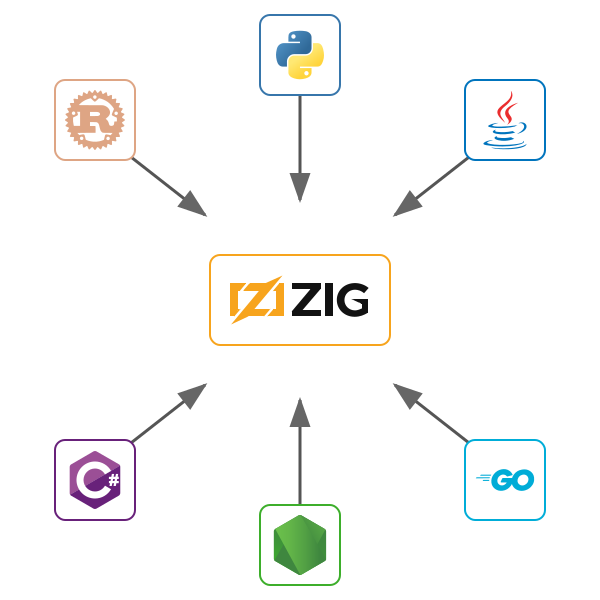

# Toolchain Horizons: Exploring Dependency-Toolchain Compatibility

Last year I created the Rust client for [TigerBeetle](https://github.com/tigerbeetle/tigerbeetle),
the double-entry financial accounting database.
While landing the code and establishing the minimum
supported Rust version I encountered multiple
surprises about how common Rust crates manage their toolchain dependencies.
So I did an experiment to learn more about toolchain
support in the Rust dependency landscape.

In the course of this experiment I learned
that common Rust crates support
only 1-2 years of prior Rust toolchains;
I removed every dependency from the TigerBeetle Rust client,
and replaced modern Rust language features
until it was compatible with Rust 1.39, from 2019.
For the sake of curiosity.


## Background: TigerBeetle clients

TigerBeetle has a client-server architecture,
and provides client libraries for most popular languages:
Python, Java, Go, Node, .NET, and now Rust.
Each of these is a bindings/FFI project that binds
to the single `tb_client` library,
written in Zig,
exposing a C ABI,
wrapped in the idioms of the embedding language.





The Rust client is less than two thousand lines of production Rust code,
some of it generated, some of it written by hand.
It provides a simple asynchronous,
futures-oriented API for use with `async` / `await`;
and it is runtime-agnostic,
requiring no dependencies on specific Rust async runtimes.

In use it looks like this:

```rust
use tigerbeetle as tb;

// Connect to TigerBeetle
let client = tb::Client::new(0, "127.0.0.1:3000")?;

// Create two accounts on the same ledger
let accounts = [
    tb::Account {
        id: tb::id(),
        ledger: 1,
        code: 1,
        ..Default::default()
    },
    tb::Account {
        id: tb::id(),
        ledger: 1,
        code: 1,
        ..Default::default()
    },
];
client.create_accounts(&accounts).await?;

// Transfer 100 units from the first account to the second
let transfers = [tb::Transfer {
    id: tb::id(),
    debit_account_id: accounts[0].id,
    credit_account_id: accounts[1].id,
    amount: 100,
    ledger: 1,
    code: 1,
    ..Default::default()
}];
client.create_transfers(&transfers).await?;
```


## Background: MSRV discovery

The Rust ecosystem has a concept of
the "Minimum Supported Rust Version" (MSRV) for its crates.
This means exactly what it sounds like.
It is a versioning scheme that relates crates
to the Rust compiler version,
and it is separate from SemVer,
Rust's primary versioning scheme.

Some crates encode this information in
their `Cargo.toml` manifest's optional
[`rust-version`](https://doc.rust-lang.org/cargo/reference/rust-version.html)
field.
It is a best practice for crate maintainers
to know and document their minimum supported Rust version
and test against that version in their CI.

When I do the initial development of a new Rust crate,
I don't worry about the minimum Rust version;
I save that work for just before publication,
a process like:

1. Start with the oldest version I know I support.
2. Test against the previous version.
3. Fix the build.

   This usually involves removing or replacing dependencies,
   and replacing newer language features with older ones
   or dependencies that fill that role.
   Open-coded polyfills are often involved.
4. Update CI to verify that as the minimum supported Rust version.
4. Do it again.

When I posted the [initial pull request] for
the Rust TigerBeetle client in June 2025,
I had not done this yet,
and expected our minimum supported Rust version to be a recent one.
Without any effort to support older releases,
the client's initial MSRV was Rust 1.81,
published September 5, 2024.

About 9 months of supported toolchains.
Not satisfactory, but not surprising.


## TigerStyle and dependencies

TigerBeetle has a set of strict and opinionated
coding guidelines,
[TigerStyle](https://github.com/tigerbeetle/tigerbeetle/blob/main/docs/TIGER_STYLE.md).
They are focused on three pillars:
safety, performance, and developer UX.

TigerStyle emphasizes fully understanding and owning your code
and radically reducing dependencies.

It has this to say about dependencies:

> TigerBeetle has a “zero dependencies” policy,
  apart from the Zig toolchain.
  Dependencies, in general, inevitably lead to supply chain attacks,
  safety and performance risk, and slow install times.
  For foundational infrastructure in particular,
  the cost of any dependency is further amplified throughout the rest of the stack.

In order to support older Rust toolchains,
and as a general matter of TigerStyle,
one of my first tasks to land the Rust client
was to judiciously remove crate dependencies.


## Reducing TigerBeetle Rust client dependencies

At the start of the process the client's dependencies were thus:

```toml
[package]
name = "tigerbeetle"
version = "0.1.0"
edition = "2021"

[dependencies]
bitflags = "2.6.0"
futures = "0.3.31"
thiserror = "2.0.3"

[build-dependencies]
anyhow = "1.0.93"
ignore = "0.4.23"

[dev-dependencies]
anyhow = "1.0.93"
tempfile = "3.15.0"
```

To Rust programmers this is common stuff,
dependecies most of us use.

Only 3 dependencies for production code,
more for the build script and test.
Some might consider it important to
reduce production dependencies while allowing
build- and test-time dependencies;
but it's important to realize that build
and dev dependencies still affect cargo's
ability to resolve the crate graph.
In particular,
build and dev dependencies that declare a supported `rust-version`
will limit your ability to compile on older toolchains.

Most of these are reasy to remove.


## The Rust `futures` dependency problem

The `futures` crate is not easy to remove.

The `futures` crate is fundamentally important
to the Rust ecosystem.
It was where the original futures implementation was prototyped,
and continues to maintain code that is so important
that it continues to be all but required for using async Rust.
I suspect that most sizable Rust projects depend on the `futures` crate.
It is an official crate maintained by the Rust project.

It's a big dependency,
as shown in this dependency graph from `cargo tree`:

```
futures v0.3.31
├── futures-channel v0.3.31
│   ├── futures-core v0.3.31
│   └── futures-sink v0.3.31
├── futures-core v0.3.31
├── futures-executor v0.3.31
│   ├── futures-core v0.3.31
│   ├── futures-task v0.3.31
│   └── futures-util v0.3.31
│       ├── futures-channel v0.3.31 (*)
│       ├── futures-core v0.3.31
│       ├── futures-io v0.3.31
│       ├── futures-macro v0.3.31 (proc-macro)
│       │   ├── proc-macro2 v1.0.90
│       │   │   └── unicode-ident v1.0.14
│       │   ├── quote v1.0.37
│       │   │   └── proc-macro2 v1.0.90 (*)
│       │   └── syn v2.0.88
│       │       ├── proc-macro2 v1.0.90 (*)
│       │       ├── quote v1.0.37 (*)
│       │       └── unicode-ident v1.0.14
│       ├── futures-sink v0.3.31
│       ├── futures-task v0.3.31
│       ├── memchr v2.7.4
│       ├── pin-project-lite v0.2.15
│       ├── pin-utils v0.1.0
│       └── slab v0.4.9
├── futures-io v0.3.31
├── futures-sink v0.3.31
├── futures-task v0.3.31
└── futures-util v0.3.31 (*)
```

The `futures` crate is a "façade" crate &mdash;
it mostly reexports other crates into a single interface.

Notice that `futures` transitively depends on
[`syn`] and [`proc-macro`].
These two are fundamental ecosystem crates in their own right,
used when implementing macros.
They are not official crates
but they are critical and tightly related to the Rust compiler,
tracking its lexical structure, syntax and macro interfaces.

This is a very sticky dependency,
tough to eliminate from large Rust programs.


## Part 2

So I did my rework on the Rust client pull request,
removing one dependency at a time,
reducing the MSRV.

I had succeeding in reducing the MSRV to 1.63
after removing dependencies on those crates
which were simplest to remove: `ignore`,
`walkdir`, `anyhow`, `thiserror`, `tempfile`.
Most everything but `futures`.

Then one day I resumed my work
and found the The Rust client no longer built on our CI:
the `syn` crate had published a point release that broke our build.

It wasn't an accidental breaking change.
It was `rust-version`.
In `syn` version `2.0.107`,
its `rust-version` changed from 1.61 to 1.68.

My work undone.

Yes in a point release this crate broke backwards toolchain compatibility.
This seems to be considered a valid thing to change in a point release among Rust maintainers,
though I have no insight into the rationale &mdash;
it is plainly a "breaking change" in some reasonable sense,
generally discouraged in point releases.

I was greatly annoyed,
so I did an experiment to learn more
about the state of crate-toolchain compatibility.


## The experiment and its results

I tested the top 100 crates from crates.io by download count
to find the oldest Rust version each could compile with.
For each crate I created a minimal project depending on it,
then binary-searched through Rust releases from 1.0 to 1.90
to find the oldest compatible toolchain.

The chart below shows the results.
Each bar represents a crate's compatibility window &mdash;
the span of Rust versions from its oldest compatible release to the present.


todo commentary

The oldest supported toolchains we see here are 1.31, December 2018.
This is the release of Rust that introduced [edition 2018].
I was curious if 1.31 and edition 2018 was _really_ a hard support
cutoff like the experiment says.

todo


## Removing the `futures` dependency


## Removing Rust language features for further compatibility

todo

| Rust | Date   | Features                                                              |
|------|----------|-----------------------------------------------------------------------|
| 1.56 |    | [format string captures], [`Path::try_exists`], [`const Mutex::new`]  |
| 1.55 |    | [`rust-version`] (stabilized [1.56])                                  |
| 1.55 |    | [Edition 2021]→2018, [`TryFrom`]                                      |
| 1.53 |   | [`CARGO_TARGET_TMPDIR`] (stabilized [1.54])                           |
| 1.51 |    | [`IntoIterator` for arrays] (stabilized [1.53])                       |
| 1.50 |    | [const generics] (stabilized [1.51])                                  |
| 1.45 |    | [array impls] for lengths > 32 (stabilized [1.47])                    |
| 1.42 |   | [associated constants] ([`u64::MAX`]) (stabilized [1.43])             |
| 1.41 |   | [`matches!`] (stabilized [1.42])                                      |
| 1.39 |    | [`todo!`], [`mem::take`], [`non_exhaustive`] (stabilized [1.40])      |


I'll do a followup post with more details about every
crate and every language feature I removed from the TigerBeetle Rust client
as well as how I did it.
I think it might be interesting to Rust historians.


## Why support older Rust versions, and does it matter that we can't?

I've been asked multiple times why bother supporting older Rust versions.

So I've had to think about this a bit,
and I'm not sure it does matter to support older Rust compilers.
The reality we're in now we're most Rust projects
are forced to "keep up" with the ecosystem and compiler is working ok.


There does seem to be an acceptance within Rust
that everybody should just use recent versions of the compiler,
probably accompanied by some thinking about how stable Rust is
and that upgrading is pretty easy usually.

The Rust compiler and standard library are fairly stable,
at least with respect to backwards compatibility.
The Rust crate ecosystem is not very stable &mdash;
they have too much incentive to adopt new compiler and language features.

todo


Based on my experience here I think there's about a 2 year
window in which any particular Rust compiler is viable.
Most projects need to update their Rust compiler with at least this frequency
in order to stay compatible with, and have the ability to upgrade to,
new releases of their dependencies.


Does it matter that we can't?

Probably not.


So what about TigerBeetle's zero-dependency policy?

