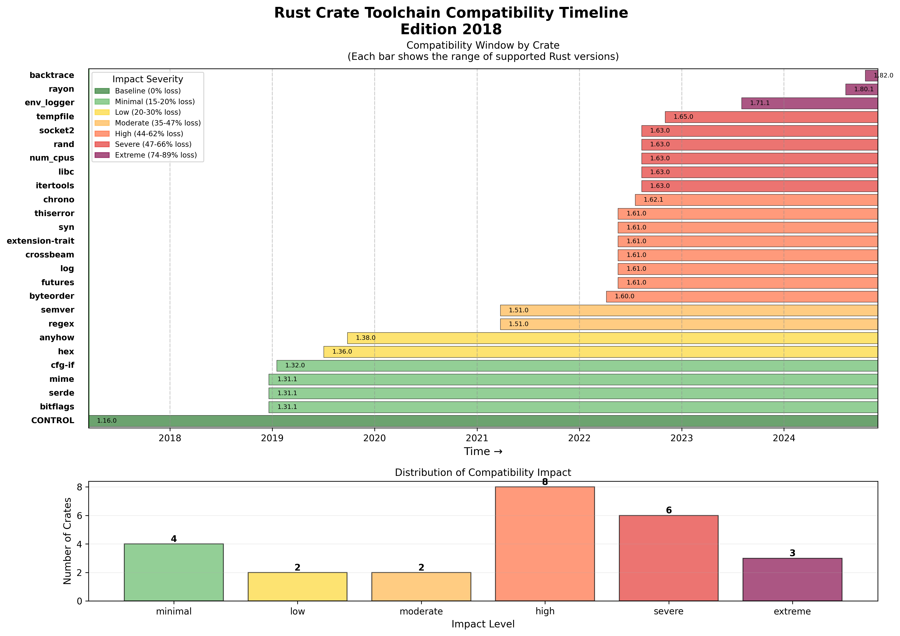

# How dependencies destroy your Rust MSRV

While preparing the [Rust client](https://github.com/tigerbeetle/tigerbeetle/tree/main/src/clients/rust) for [TigerBeetle](https://tigerbeetle.com/) for production, I needed to determine the minimum supported Rust version (MSRV).

The standard approach is inefficient: start with an old toolchain, binary search through compiler errors and dependency failures until something builds, then watch the MSRV drift forward as dependencies update.

This process revealed a fundamental constraint:

> **When you add Rust dependencies to a project, you are constrained to supporting only the most recent 2-3 years of Rust toolchains, regardless of your own code's compatibility.**

This happens even with dev-dependencies. The cost compounds with each dependency, and you will spend engineering time tracking toolchain requirements just to stay in this moving window.

For TigerBeetle's Rust client, the MSRV settled at Rust 1.63 (August 2022), which is 2.5 years before publication. This represents the median of the current ecosystem. Attempting to support older versions requires exponentially increasing effort until it becomes impractical.

This raises a question: Rust's stability guarantees are well-known. The compiler maintains backward compatibility. So why does the ecosystem impose such a narrow compatibility window?

More importantly: **What is the actual cost of each dependency?**

I designed an experiment to measure this precisely.

## The experiment

To measure the MSRV cost of dependencies, I selected 29 foundational Rust crates that commonly appear in production projects: `serde`, `rand`, `futures`, `log`, and similar widely-used libraries.

For each crate, I created a minimal project with that single dependency and used binary search to determine the oldest Rust toolchain that could compile it. This provides an isolated measurement of each dependency's minimum toolchain requirement.

**Experimental parameters:**
- Edition 2018 (baseline MSRV: Rust 1.31.0)
- Latest stable version specifications (`"1"` for serde, `"0.3"` for futures)
- Binary search space: all stable Rust releases from 1.0.0 to 1.90.0 (90 versions)
- Each toolchain generates its own Cargo.lock, but all use the same Cargo.toml
- Search complexity: log₂(90) ≈ 7 compilations per crate

A control project with zero dependencies establishes the baseline compatibility range.

## The results

**Control (no dependencies):** Compiles on Rust 1.16.0 (March 2017) through 1.90.0

That's 74 versions, spanning 7.4 years of Rust history. Pretty good!

Now here's what happens when you add a single dependency:

### The spectrum of pain

The least restrictive dependencies still hurt:

- `bitflags`, `serde`, `mime`: Require Rust 1.31.1 (Dec 2018)
  - That's **20% version loss**, 1.8 years newer than baseline

Most common crates hit what I'm calling "the 2022 wall":

- `futures`, `log`, `crossbeam`, `syn`, `thiserror`: Require Rust 1.61.0 (May 2022)
  - **61% version loss**, 5.2 years newer
- `rand`, `itertools`, `libc`, `num_cpus`: Require Rust 1.63.0 (Aug 2022)
  - **64% version loss**, 5.4 years newer

Then there are the really aggressive ones:

- `rayon`: Requires Rust 1.80.1 (Aug 2024)
  - **86% version loss** - only 4 months old when I ran this!
- `backtrace`: Requires Rust 1.82.0 (Oct 2024)
  - **89% version loss** - basically requires the latest toolchain

## What this means

Adding `rand` or `itertools` to a library eliminates support for Rust 2017-2021 immediately. Five years of toolchain history become unavailable. The MSRV jumps to August 2022 or newer.

This affects 16 out of 29 tested crates—these are not experimental packages, but foundational ecosystem dependencies.

The critical observation: **time compression**. The compatibility window contracts from 7.4 years to as little as 4 months. This happens independent of your code's actual requirements. The dependency's adoption of new language features determines your MSRV, not your code's needs.

## The 2022 wall

More than half of tested crates cluster around Rust 1.61-1.63 (mid-2022). This represents a sharp discontinuity in the ecosystem's MSRV distribution.

The likely causes:
- Generic associated types (GATs) stabilized in Rust 1.65, creating pressure for crates to adopt 1.63+ as a baseline
- Edition 2021 (requiring Rust 1.56+) prompted ecosystem-wide MSRV updates
- Accumulated language features from 1.56-1.65 created sufficient value to justify raising MSRVs

The practical consequence: selecting dependencies today means accepting a 2022+ toolchain requirement with >50% probability per dependency.

## Edition 2018 vs 2021

This experiment used edition 2018 (baseline: Rust 1.31.0, December 2018). Edition 2021 would shift the baseline to Rust 1.56.0 (October 2021), eliminating 40 additional versions (44% of the compatibility window).

The edition choice is significant, but dependencies dominate the MSRV calculation. Even with edition 2018, most dependencies require Rust 1.61+, making the edition choice largely irrelevant for projects with dependencies.

## Cross-language comparison

To determine if this constraint is specific to Rust, I ran equivalent experiments on Python, Java, and Node.js using the same methodology: binary search to find the oldest compatible runtime for popular packages.

**The answer: this is predominantly a Rust phenomenon.**

- **Java**: All 26 tested packages support Java 8 through Java 23 (10+ years). Dependencies impose zero constraint on runtime version.

- **Python**: 84% of packages (16/19) support the full tested range (Python 3.8-3.13, 6 years). Only numpy requires 3.9+. Dependency cost is minimal.

- **Node.js**: 33% of packages support Node 14+, while 24% require Node 20+ (2023). Resembles Rust's pattern but less severe.

The mechanisms behind these differences are architectural:

**Java's compatibility** derives from:
- JVM bytecode stability (versioned class file format)
- Multi-release JAR support (single artifact, multiple bytecode versions)
- 8+ year LTS windows with commercial support incentives

**Python's compatibility** derives from:
- Slower language evolution (3.x series stability)
- `python_requires` metadata enforcement by package managers
- Large installed base creating backward compatibility pressure

**Rust and Node.js share** rapid iteration cycles, frequent breaking changes, and cultural acceptance of moving fast. But Rust's pattern is more extreme: 64% of tested Rust crates require versions <3 years old, versus 24% for Node.

The consequence for Rust: while the compiler rarely breaks existing code, the ecosystem operates on different principles. Individual crate authors optimize for new features over compatibility. The aggregate effect constrains the entire ecosystem to a 2-3 year compatibility window.

(Detailed cross-language results in the appendix below.)

## Implications

**For library authors:**
- Each dependency costs 1-5 years of toolchain compatibility
- "Stable" foundational crates still advance their MSRV requirements
- MSRV is determined by the maximum of all transitive dependencies
- Audit dependency MSRVs before adding them

**For application authors:**
- Your MSRV equals your most aggressive dependency's requirement
- Supporting older systems requires dependency auditing
- The cost is not hypothetical: 1 dependency can eliminate 5 years of toolchain support

**On dependencies generally:**

Dependencies provide value. Reimplementing standard functionality is usually wrong. But the cost is quantifiable: a single `rand` or `futures` dependency eliminates Rust 2017-2021.

This is not inherently bad. Rust evolves rapidly, and new features provide value. But it represents a tradeoff: innovation speed versus compatibility breadth. Different ecosystems weight these differently. Java optimizes for compatibility. Rust optimizes for feature velocity.

The experiment code and complete results are available on [GitHub](https://github.com/brson/dep-tool-comp).

---

## Appendix: Cross-language comparison

For the curious, here are the detailed results from testing Python, Java, and Node.js.

### Python

**Control (no dependencies):** Python 3.8 (Oct 2019) → 3.13 (Oct 2024) — 6 years

**Dependency impact:** Minimal

- 84% (16/19) of packages support the full range (Python 3.8-3.13)
- numpy requires Python 3.9+ (eliminates 1 version, 17% loss)
- 3 packages had installation failures (likely binary compilation issues, not version constraints)

**Tested packages:** certifi, charset-normalizer, click, idna, jinja2, markupsafe, packaging, platformdirs, pluggy, pytest, pytz, requests, setuptools, six, urllib3, numpy, pillow, pyyaml, python-dateutil

### Java

**Control (no dependencies):** Java 8 (2014) → Java 23 (2024) — 10+ years

**Dependency impact:** Zero

- 100% (26/26) of packages support Java 8 through Java 23
- This includes cutting-edge versions: JUnit 6.0.0-RC3, OkHttp 5.0.0-alpha.17, Jackson 2.20.0
- Dependencies impose no runtime version constraints

**Tested packages:** Apache Commons (lang3, io, collections4, text, math3, csv), SLF4J, Logback, Gson, Jackson, JUnit 5, Mockito, AssertJ, Guava, Apache HttpClient, OkHttp, Joda-Time, RxJava, H2, PostgreSQL driver, HikariCP, DOM4J, SnakeYAML, javax.inject, Guice, Jakarta Validation API

### Node.js

**Control (no dependencies):** Node 14 (2020) → Node 24 (2024) — ~4 years

**Dependency impact:** Significant

- 33% of packages support Node 14+
- 29% require Node 18+ (2022)
- 24% require Node 20+ (2023)
- 10% failed on all tested versions

**Notable requirements:**
- express, koa, jest, mocha: Node 18+
- commander, yargs: Node 20+

**Tested packages:** express, koa, lodash, date-fns, uuid, axios, node-fetch, jest, mocha, vitest, async, commander, yargs, chalk, fs-extra, glob, joi, zod, pg, winston, pino

### Mechanisms

**Java (10 years, 0% dependency cost):**
- Bytecode format stability with versioning
- Multi-release JARs (single artifact, multiple target versions)
- 8+ year LTS support windows
- Commercial incentives for backward compatibility

**Python (6 years, <1% dependency cost):**
- Stable 3.x language design (incremental evolution)
- `python_requires` metadata with package manager enforcement
- Large installed base creating compatibility pressure

**Node.js (4 years, ~25% dependency cost):**
- 6-month major release cycle
- 3-year LTS windows
- ESM/CommonJS transition creating ecosystem churn

**Rust (7.4 years baseline, 64% dependency cost):**
- 6-week release cycle with new features
- No MSRV enforcement in package metadata (until recently)
- Edition system creating discrete upgrade points
- Ecosystem culture prioritizing feature adoption

---

## Methodology

**Rust:**
- Version specifications: major versions for >= 1.0 crates, major.minor for < 1.0
- Each toolchain generates independent Cargo.lock
- Binary search over 90 stable releases (1.0.0 to 1.90.0)
- Search cost: log₂(90) ≈ 7 compilations per crate
- Tested: October 2024, Linux
- 1 crate (derive_more) failed to compile, excluded from results

**Python:**
- Binary search using `uv` package manager
- Validation: successful import after installation
- Major version specifications for maximum flexibility

**Java:**
- Binary search using Maven
- Validation: successful compilation
- Major version specifications

**Node.js:**
- Binary search using nvm
- Validation: successful runtime import
- Major version specifications

Complete code and raw data: [GitHub repository](https://github.com/brson/dep-tool-comp)
